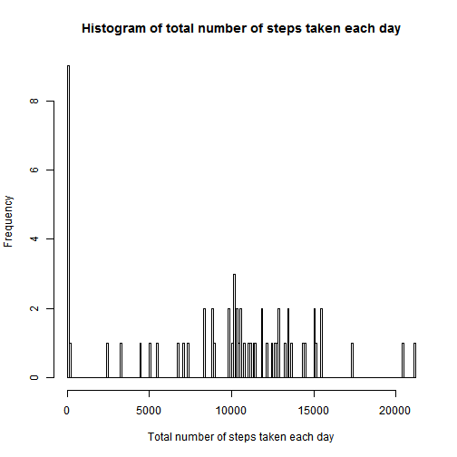
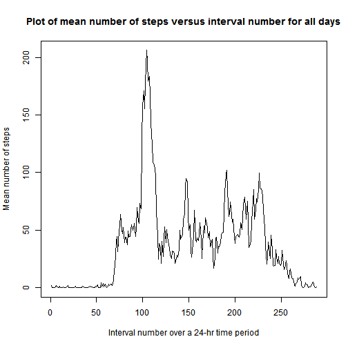
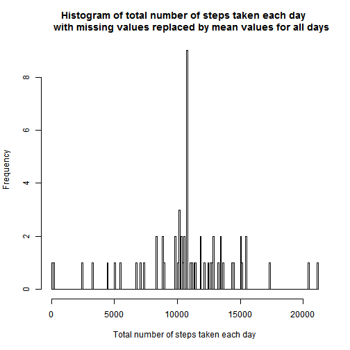
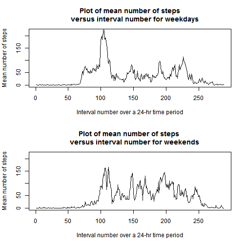

# Reproducible Research: Peer Assessment 1


## Loading and preprocessing the data

This project is an analysis of activity (number of steps) measured by a personal activity measuring device. The dataset is in a .csv file and has 3 variables:
  - steps (integer): steps taken in each 5-min interval (missing values = NA).
  - date (factor): date when measurements were taken (%Y-%m-%d format).
  - interval (integer): id for each 5-min interval over a 24-hour period.

There are 17,568 observations altogether (288 intervals each day over a total of 61 days).

The following code reads the data from the file.


```r
df <- read.csv("activity.csv")
```


## What is mean total number of steps taken per day?

The following code presents a histogram of number of steps taken on various days. The x-axis has the number of steps, and the y-axis has the number of days on which that number of steps were taken.


```r
hist(with(df, tapply(steps, date, sum, na.rm = TRUE)), length(unique(df$interval)), 
    main = "Histogram of total number of steps taken each day", xlab = "Total number of steps taken each day")
```

 


The greatest number of steps on a day fall in the range of about 10,000 to 15,000. On 9 days, 0 steps were recorded. (This does not include missing values.) The 0 values could represent complete inactivity but are more likely to be related to malfunction of the machine or error.

The following printout shows the mean and median for the number of steps taken on each day. NaN and NA indicate that all values were missing on that particular day.


```r
means <- with(df, tapply(steps, date, mean, na.rm = TRUE))
medians <- with(df, tapply(steps, date, median, na.rm = TRUE))
row_names <- names(means)
merge(data.frame(date = row_names, mean = means), data.frame(date = row_names, 
    median = medians), by = "date")
```

```
##          date    mean median
## 1  2012-10-01     NaN     NA
## 2  2012-10-02  0.4375      0
## 3  2012-10-03 39.4167      0
## 4  2012-10-04 42.0694      0
## 5  2012-10-05 46.1597      0
## 6  2012-10-06 53.5417      0
## 7  2012-10-07 38.2465      0
## 8  2012-10-08     NaN     NA
## 9  2012-10-09 44.4826      0
## 10 2012-10-10 34.3750      0
## 11 2012-10-11 35.7778      0
## 12 2012-10-12 60.3542      0
## 13 2012-10-13 43.1458      0
## 14 2012-10-14 52.4236      0
## 15 2012-10-15 35.2049      0
## 16 2012-10-16 52.3750      0
## 17 2012-10-17 46.7083      0
## 18 2012-10-18 34.9167      0
## 19 2012-10-19 41.0729      0
## 20 2012-10-20 36.0938      0
## 21 2012-10-21 30.6285      0
## 22 2012-10-22 46.7361      0
## 23 2012-10-23 30.9653      0
## 24 2012-10-24 29.0104      0
## 25 2012-10-25  8.6528      0
## 26 2012-10-26 23.5347      0
## 27 2012-10-27 35.1354      0
## 28 2012-10-28 39.7847      0
## 29 2012-10-29 17.4236      0
## 30 2012-10-30 34.0938      0
## 31 2012-10-31 53.5208      0
## 32 2012-11-01     NaN     NA
## 33 2012-11-02 36.8056      0
## 34 2012-11-03 36.7049      0
## 35 2012-11-04     NaN     NA
## 36 2012-11-05 36.2465      0
## 37 2012-11-06 28.9375      0
## 38 2012-11-07 44.7326      0
## 39 2012-11-08 11.1771      0
## 40 2012-11-09     NaN     NA
## 41 2012-11-10     NaN     NA
## 42 2012-11-11 43.7778      0
## 43 2012-11-12 37.3785      0
## 44 2012-11-13 25.4722      0
## 45 2012-11-14     NaN     NA
## 46 2012-11-15  0.1424      0
## 47 2012-11-16 18.8924      0
## 48 2012-11-17 49.7882      0
## 49 2012-11-18 52.4653      0
## 50 2012-11-19 30.6979      0
## 51 2012-11-20 15.5278      0
## 52 2012-11-21 44.3993      0
## 53 2012-11-22 70.9271      0
## 54 2012-11-23 73.5903      0
## 55 2012-11-24 50.2708      0
## 56 2012-11-25 41.0903      0
## 57 2012-11-26 38.7569      0
## 58 2012-11-27 47.3819      0
## 59 2012-11-28 35.3576      0
## 60 2012-11-29 24.4688      0
## 61 2012-11-30     NaN     NA
```


The median values are 0 because there are so many 5-min intervals during which no steps were taken. This is expected unless the subject is constantly walking throughout the day.


## What is the average daily activity pattern?

The following plot shows the mean number of steps versus interval number for all days, i.e., a time sequence plot. For each interval (x-axis), results for the number of steps on all days have been added and divided by the number of valid observations to produce the y-axis value. Also, the interval during which there are the maximum mean number of steps is calculated.


```r
mean_daily_steps <- with(df, tapply(steps, interval, mean, na.rm = TRUE))
plot(mean_daily_steps, type = "l", main = "Plot of mean number of steps versus interval number for all days", 
    xlab = "Interval number over a 24-hr time period", ylab = "Mean number of steps")
```

 

```r
df_daily_steps <- data.frame(interval = 1:length(mean_daily_steps), mean_daily_steps)
max_daily_steps <- max(mean_daily_steps)
subset(df_daily_steps, mean_daily_steps == max_daily_steps)$interval
```

```
## [1] 104
```

```r
max_daily_steps
```

```
## [1] 206.2
```


The hours after midnight can be obtained by dividing the interval number by 12. Activity first increases at about 0530-0600, presumably upon getting out of bed. It reaches a peak at about 0900, then declines. There are a few smaller peaks at times in the range 1200 to 1900, and activity has declined to 0 by about 2300, presumably at bedtime. Interval 104 has the maximum mean number of steps (206.1698). This corresponds to time between 103/12 and 104/12 hours after midnight, i.e., 0835 and 0840.


## Imputing missing values

The following code calculates and shows the total number of missing values (number of rows with NA for number of steps).


```r
sum(is.na(df$steps))
```

```
## [1] 2304
```


There are 2304 missing values. (The same calculation was done using df$date and df$interval, yielding 0 and confirming that there are no missing values for these parameters.)

The following code replaces each missing value with the corresponding value from the results for mean daily steps for each time interval. It is assumed that if a value for number of steps during an interval is missing, the most likely number of steps would be an average of the number taken during that same interval on all other days. (Using the code directly above with the mean daily steps array, it was confirmed that there is no interval for which number of steps are missing on all days.)


```r
steps_new <- df$steps
mean_daily_steps_rep <- rep(mean_daily_steps, length(unique(df$date)))
for (i in 1:length(steps_new)) {
    if (is.na(steps_new[i])) 
        steps_new[i] <- mean_daily_steps_rep[i]
}
df_na_replaced <- data.frame(steps = steps_new, date = df$date, interval = df$interval)
```


The following code presents another a histogram like the previous one except that missing values have been replaced.


```r
hist(with(df_na_replaced, tapply(steps, date, sum, na.rm = TRUE)), length(unique(df$interval)), 
    main = ("Histogram of total number of steps taken each day \n     with missing values replaced by mean values for all days"), 
    xlab = "Total number of steps taken each day")
```

 


The main difference is a decrease in the number of days on which 0 steps were recorded. This is because there were some missing values on those same days, and filling in the missing values made the total no longer 0. There is also a corresponding increase in frequency of a particular number of steps slightly over 10,000.

The following printout shows the mean and median for the number of steps taken on each day with replacement of the missing values.


```r
means <- with(df_na_replaced, tapply(steps, date, mean, na.rm = TRUE))
medians <- with(df_na_replaced, tapply(steps, date, median, na.rm = TRUE))
row_names <- names(means)
merge(data.frame(date = row_names, mean = means), data.frame(date = row_names, 
    median = medians), by = "date")
```

```
##          date    mean median
## 1  2012-10-01 37.3826  34.11
## 2  2012-10-02  0.4375   0.00
## 3  2012-10-03 39.4167   0.00
## 4  2012-10-04 42.0694   0.00
## 5  2012-10-05 46.1597   0.00
## 6  2012-10-06 53.5417   0.00
## 7  2012-10-07 38.2465   0.00
## 8  2012-10-08 37.3826  34.11
## 9  2012-10-09 44.4826   0.00
## 10 2012-10-10 34.3750   0.00
## 11 2012-10-11 35.7778   0.00
## 12 2012-10-12 60.3542   0.00
## 13 2012-10-13 43.1458   0.00
## 14 2012-10-14 52.4236   0.00
## 15 2012-10-15 35.2049   0.00
## 16 2012-10-16 52.3750   0.00
## 17 2012-10-17 46.7083   0.00
## 18 2012-10-18 34.9167   0.00
## 19 2012-10-19 41.0729   0.00
## 20 2012-10-20 36.0938   0.00
## 21 2012-10-21 30.6285   0.00
## 22 2012-10-22 46.7361   0.00
## 23 2012-10-23 30.9653   0.00
## 24 2012-10-24 29.0104   0.00
## 25 2012-10-25  8.6528   0.00
## 26 2012-10-26 23.5347   0.00
## 27 2012-10-27 35.1354   0.00
## 28 2012-10-28 39.7847   0.00
## 29 2012-10-29 17.4236   0.00
## 30 2012-10-30 34.0938   0.00
## 31 2012-10-31 53.5208   0.00
## 32 2012-11-01 37.3826  34.11
## 33 2012-11-02 36.8056   0.00
## 34 2012-11-03 36.7049   0.00
## 35 2012-11-04 37.3826  34.11
## 36 2012-11-05 36.2465   0.00
## 37 2012-11-06 28.9375   0.00
## 38 2012-11-07 44.7326   0.00
## 39 2012-11-08 11.1771   0.00
## 40 2012-11-09 37.3826  34.11
## 41 2012-11-10 37.3826  34.11
## 42 2012-11-11 43.7778   0.00
## 43 2012-11-12 37.3785   0.00
## 44 2012-11-13 25.4722   0.00
## 45 2012-11-14 37.3826  34.11
## 46 2012-11-15  0.1424   0.00
## 47 2012-11-16 18.8924   0.00
## 48 2012-11-17 49.7882   0.00
## 49 2012-11-18 52.4653   0.00
## 50 2012-11-19 30.6979   0.00
## 51 2012-11-20 15.5278   0.00
## 52 2012-11-21 44.3993   0.00
## 53 2012-11-22 70.9271   0.00
## 54 2012-11-23 73.5903   0.00
## 55 2012-11-24 50.2708   0.00
## 56 2012-11-25 41.0903   0.00
## 57 2012-11-26 38.7569   0.00
## 58 2012-11-27 47.3819   0.00
## 59 2012-11-28 35.3576   0.00
## 60 2012-11-29 24.4688   0.00
## 61 2012-11-30 37.3826  34.11
```


## Are there differences in activity patterns between weekdays and weekends?

The following code divides the data according to whether the date is a weekday or weekend and then recalculates the results and presents the data in two time sequence plots. The dataset with missing values replaced has been used. The x- and y-axes of the plots are equivalent so that the two plots can be compared.


```r
date_days_of_week <- weekdays(strptime(df$date, format = "%Y-%m-%d"))
weekend <- c("Saturday", "Sunday")
for (i in 1:length(date_days_of_week)) {
    if (date_days_of_week[i] %in% weekend) 
        date_days_of_week[i] <- "weekend" else date_days_of_week[i] <- "weekday"
}
df_weekday_weekend <- data.frame(steps = steps_new, date = as.factor(date_days_of_week), 
    interval = df$interval)
list_weekday_weekend <- split(df_weekday_weekend, df_weekday_weekend$date)

par(mfrow = c(2, 1))

mean_daily_steps <- with(list_weekday_weekend[[1]], tapply(steps, interval, 
    mean))
plot(mean_daily_steps, type = "l", ylim = c(0, 220), main = "Plot of mean number of steps\n     versus interval number for weekdays", 
    xlab = "Interval number over a 24-hr time period", ylab = "Mean number of steps")

mean_daily_steps <- with(list_weekday_weekend[[2]], tapply(steps, interval, 
    mean))
plot(mean_daily_steps, type = "l", ylim = c(0, 220), main = "Plot of mean number of steps \n     versus interval number for weekends", 
    xlab = "Interval number over a 24-hr time period", ylab = "Mean number of steps")
```

 


The main differences in the weekend, as compared to the weekday, data are (a) a decrease in the amount of morning activity, especially in the range of about 0530 to 0830, (b) a moderate generalised increase in activity in the afternoon and evening and (c) a definite increase in activity at a late hour of about 1930 to 2140. This is consistent with weekday work causing the subject to get up earlier and be more active on weekday mornings. The subject's work may be the cause of the more sedentary behaviour on weekday afternoons. On weekends, the subject is probably not working and thus gets up later and tends to have more afternoon and late evening activity than is the case on weekdays.
